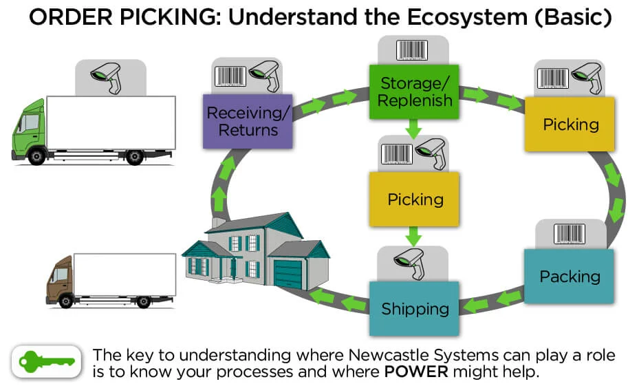

# WMS Glossary

## Overview

## Inbound

## Outbound

### Picking 拣货/拣选

- pick method 拣货方式
   - discrete order picking
      - one order-picker picks one order, one line at a time
      - ideal for paper based picking
   - zone picking 区域拣货
   - batch picking 批量拣货
   - cluster picking 集中拣货
   - wave picking
   - zone-batch picking
   - zone-wave picking
   - zone-batch-wave picking

## 通用词汇

direct 指引
